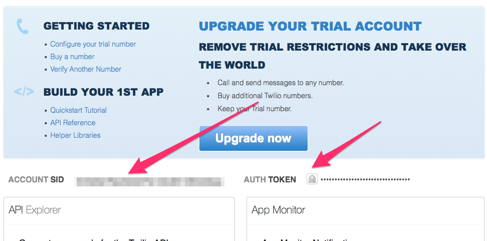

[](https://drone.io/github.com/mplacona/twilio-dart/latest)

# Twilio Wrapper for Dart
---
A Future-based wrapper for the [Twilio API](https://www.twilio.com/docs/quickstart/). With this wrapper you can get yourself on the wonderful world of communication via [SMS](https://www.twilio.com/sms/api) and [Voice](https://www.twilio.com/voice/api) (WIP).

## Dependencies
* [http](https://pub.dartlang.org/packages/http)

## [Getting Started](id:getting_started)
* Add a dependency to `twilio_dart` to your pubspec.yaml
* Run `pub get`
* Obtain a key and an authentication code on the [dashboard](https://www.twilio.com/user/account) of the Twilio website. The account is limited but free.



* You can now create a new Twilio object with your account details as such:

```dart
import 'package:twilio_dart/twilio.dart';

var key = "your_twilio_key";
var authToken = "your_auth_token";
var version = "2010-04-01";
//create a new twilio object
Twilio twilio = new Twilio(key, authToken, version);
```

> And this will allow you access o any of the currently available methods on this wrapper (more on this later)

### [Sending an SMS message](id:sending)
* Create a new Twilio object as described in [Getting Started](#getting_started).
* Replace the sample values with the ones obtained when you created your Twilio account (also described above in [Getting Started](#getting_started)).
* Define a `from`, a `to` and a `body`. __Remember you can only send SMS's from the numbers obtained from your Twilio account__.

```dart
var from = "your_twilio_phone";
var to = "your_mobile_number";
var body = "Look ma! Dart can now send SMS's in under 15 lines";
```
* Send the message away!
```dart
twilio.sendSMS(from, to, body).then((response) => print("Your message has been sent!")).catchError((error) => print(error));
```
> You can also turn your SMS message into an [MMS](http://en.wikipedia.org/wiki/Multimedia_Messaging_Service) message by including an attachment with it. The API accepts a 4th argument in the form of a URL pointing to the image you would like to send.

### [Reading a message](id:reading)
Any messages sent via Twilio are stored, so they can be later on retrieved. But most importantly, your account can also receive messages, and you need a way to retrieve it don't you?

The same Twilio object you created in Getting Started](#getting_started) can now be used to retrieve any messages by its Twilio ID.

```dart
twilio.readSMS(_messageSid);
```

### [Listing all messages](id:listing)
You're gonna wanna show a list of the messages you've received, so you can drill down to each individual message. To do so... you guessed right, you will again utilise the Twilio object you created earlier as such:

```dart
twilio.readSMSList()
```

This time, unlike with [Reading a message](#reading), you won't be passing any message ID's, as we want to list every single message in the account.

#### To be implemented
Optional parameters for:
From
To
DateSent

## But what about the browser?
The browser implementation is still highly experimental, and although tests have proven it works, I'm still not 100% happy with the way it's been implemented.

It can be used via the `twilio_browser` option. Just import

```dart
import 'package:twilio_dart/twilio_browser.dart';
```

Instead of your normal

```dart
import 'package:twilio_dart/twilio.dart';
```

__Yes, this needs work :-D __

## Bugs?
Create a new issue tagged `bug`

## Collaborate
Collaboration is the key to every successful library, and this one is no different. I would love to see my code improved, and new features added to the library. 

Just __fork__ this repository, and send me a __pull request__ when you're done. I'm using [git flow](https://github.com/nvie/gitflow) to manage new features and bugs, and would highly recommend you used the same thing. I will then be happy to turn your pull request into a release :-).

The process is as follows after you've created your fork:

```
git clone git@github.com:<username>/twilio-dart.git
cd twilio-dart
git branch master origin/master
git flow init -d
git flow feature start <your feature>
```

Do your magic and commit as often as you like. Once done run:

```
git flow feature publish <your feature>
```

When that's completed, open a pull request to your feature branch on GitHub.

[This cheatsheet](http://danielkummer.github.io/git-flow-cheatsheet/) will be useful if you want to do some other cool things.

## Test
I always try to add as much cover as I can, and am especially careful to make sure I always play nice with third party API's. If code is written correctly, you can easily mock functionality without having to actually hit the API's directly.

This obviously saves not only on the number of requests you will make every time you run the test suite, but in any limitations that might arise from running unit tests over and over again hitting the API on a trial account.

It also decouples me from the web, which means I can code on the move (I commute to work), and still run my entire suite without internet connectivity. I have used the following libraries for my unit tests:

* [mock](https://pub.dartlang.org/packages/mock)
* [unittest](https://pub.dartlang.org/packages/unittest)

## Roadmap
Like I said before, Twilio's API is very big, and the ability to send texts is just the tip of the iceberg. The following are the next things I would like to implement in the future when time permits:

* Calls
	* Make a call
	* View call
	* View call list
	* Modify a Live Call
	* View Call Recording List
	* View Call Notification List
* Recordings
	* View Recording
	* View Recording List
	* View Transcription List for Recording
	* Delete Recording
* Usage Records
	* View Usage Record List
	* View Usage Record Subresource
* Conferences
	* View Conference
	* View Conference List
	* View Participant for Conference
	* View Participant List for Conference
	* Mute Participant
	* Delete Participant

Again, not a full list, as there is much more that can be done, however, the list above are my personal preferences ;-)

## Disclaimer
I am in no way affiliated to Twilio, other than having a trial account with them, like you probably also do by now. 

This library is also not endorsed or officially supported by Twilio, though I'm pretty sure they will be happy to help if you have questions about the API itself.

